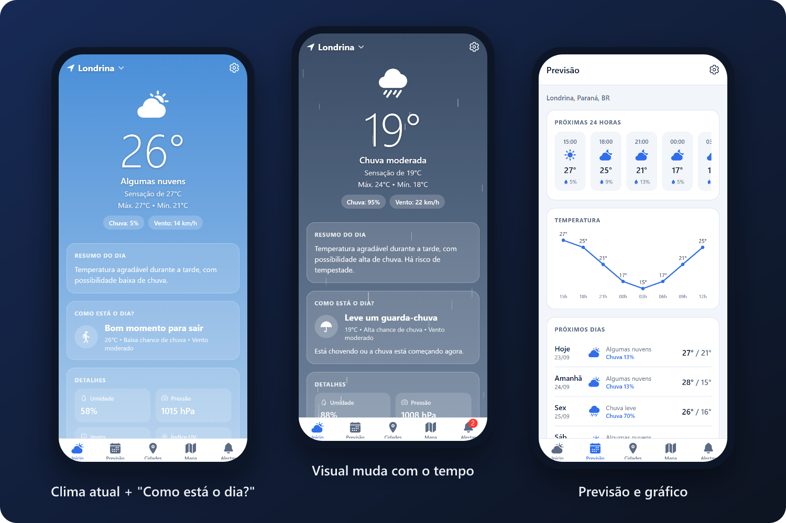
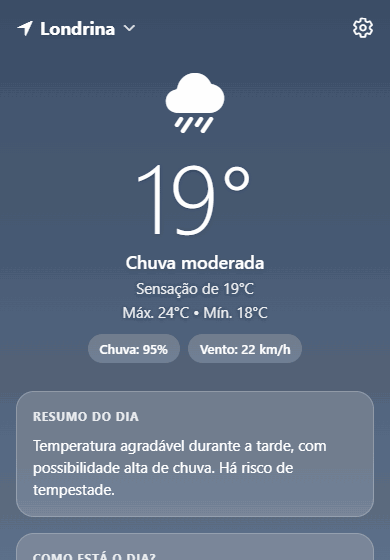
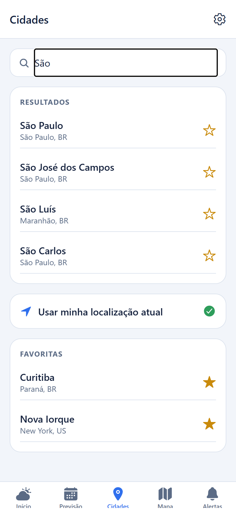
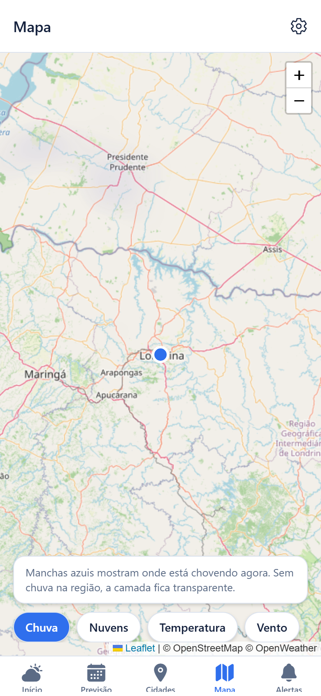
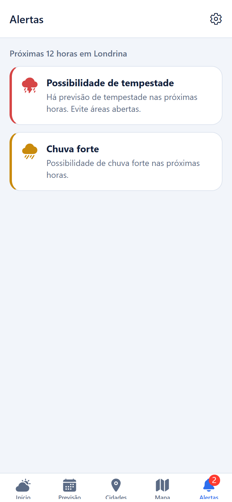
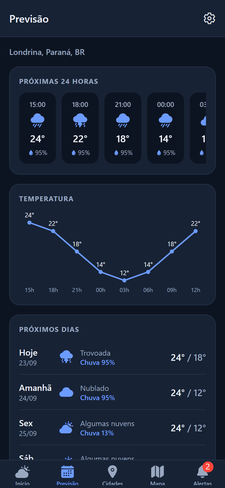
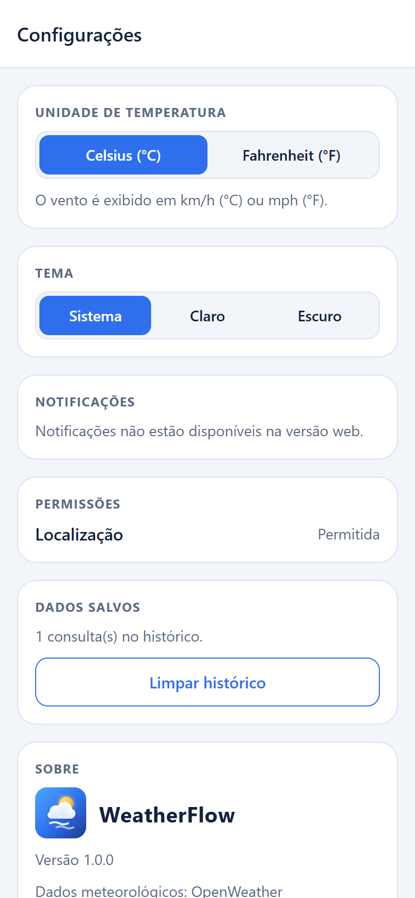
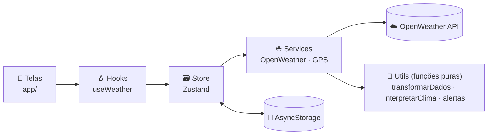

<div align="center">


<br />


**Um app de clima que não só mostra números: ele explica o que eles significam para o seu dia.**

[Funcionalidades](#-funcionalidades) •
[Telas](#-telas) •
[Como rodar](#-como-rodar) •
[APK](#-gerar-o-apk-android) •
[Arquitetura](#-arquitetura) •
[Decisões técnicas](#-decisões-técnicas)

</div>

---

<div align="center">
  
</div>

## 💡 A ideia

A maioria dos apps de clima mostra `27°C · 20% · 14 km/h` e deixa você interpretar. O **WeatherFlow** transforma esses dados em conselhos práticos na seção **"Como está o dia?"**:

<table>
<tr>
<td width="55%">

> 🚶 **Bom momento para sair**
> 26°C • Baixa chance de chuva • Vento moderado

> ☂️ **Leve um guarda-chuva**
> Chuva prevista nas próximas 2 horas.

> 💧 **Calor intenso — hidrate-se**
> Evite o sol entre 10h e 16h e use protetor solar.

A interpretação é feita por **regras** em uma função pura ([`interpretarClima.ts`](src/utils/interpretarClima.ts)), testada isoladamente. As regras são avaliadas em ordem de prioridade:

1. ⛈️ Tempestade → evite atividades externas
2. 🌬️ Vento acima de 50 km/h → evite atividades externas
3. 🌧️ Chuva agora ou prevista em até 6h → leve um guarda-chuva
4. 🥵 Sensação térmica acima de 35°C → hidrate-se
5. 🥶 Sensação térmica abaixo de 8°C → leve um agasalho
6. 🌦️ Chance de chuva moderada → tempo instável
7. 🌫️ Neblina → atenção no trânsito
8. ✅ Nenhum problema → bom momento para sair

</td>
<td width="45%" align="center">
  
  <br />
  <sub>A interface muda com o clima: gradientes, chuva animada e relâmpago na tempestade.</sub>
</td>
</tr>
</table>

## ✨ Funcionalidades

| | Funcionalidade | Detalhes |
|---|---|---|
| 📍 | **Localização automática** | GPS com tratamento de permissão negada, GPS desligado e localização aproximada |
| 🌡️ | **Clima atual completo** | Temperatura, sensação térmica, umidade, pressão, vento (velocidade e direção), índice UV, visibilidade, chance de chuva, nascer e pôr do sol |
| 💬 | **"Como está o dia?"** | Conselhos gerados por regras, sem IA, com o resumo do dia em linguagem natural |
| 📅 | **Previsão** | Próximas 24 horas, gráfico de temperatura desenhado em SVG e 5 dias |
| 🏙️ | **Cidades** | Busca com *debounce* e cidades favoritas salvas no aparelho |
| 🎨 | **Visual dinâmico** | Gradientes de dia e de noite, animação de chuva e relâmpago; respeita a opção "reduzir movimento" |
| 🗺️ | **Mapa meteorológico** | Leaflet + OpenStreetMap com camadas de chuva, nuvens, temperatura e vento (sem chave do Google) |
| 🔔 | **Alertas** | Tempestade, chuva forte, calor, frio e vento forte, com notificação local |
| 🕘 | **Histórico** | Consultas salvas por data (ex.: 23/09 — 27°C) |
| ⚙️ | **Configurações** | °C/°F, tema claro/escuro/sistema, notificações e permissões |
| 📴 | **Funciona sem internet** | Mostra os últimos dados salvos, com um aviso |

## 📱 Telas

<div align="center">
<table>
<tr>
<td align="center"><br /><sub><b>Cidades</b></sub></td>
<td align="center"><br /><sub><b>Mapa</b></sub></td>
<td align="center"><br /><sub><b>Alertas</b></sub></td>
<td align="center"><br /><sub><b>Tema escuro</b></sub></td>
<td align="center"><br /><sub><b>Configurações</b></sub></td>
</tr>
</table>

<sub>Capturas do app rodando na versão web, com dados de exemplo de Londrina (PR).</sub>
</div>

## 🚀 Como rodar

### Pré-requisitos

- [Node.js](https://nodejs.org/) 20 ou superior
- O app **Expo Go** no celular ([Android](https://play.google.com/store/apps/details?id=host.exp.exponent) · [iOS](https://apps.apple.com/app/expo-go/id982107779))
- Uma chave gratuita da [OpenWeather](https://home.openweathermap.org/users/sign_up)

### Passo a passo

```bash
# 1. Clone e instale
git clone https://github.com/KaioSilva14/Projeto-API-Clima.git
cd Projeto-API-Clima
npm install

# 2. Configure a chave da API
cp .env.example .env
# abra o .env e cole sua chave em EXPO_PUBLIC_OPENWEATHER_API_KEY

# 3. Inicie
npm start
```

Escaneie o QR Code com o Expo Go (Android) ou com a câmera (iOS).

> [!NOTE]
> Chaves novas da OpenWeather levam **até 2 horas** para serem ativadas. Até lá, o app mostra "chave inválida".

> [!TIP]
> Se o celular não conectar, verifique se ele está no mesmo Wi-Fi do computador ou use `npx expo start --tunnel`.

### Comandos

| Comando | O que faz |
|---|---|
| `npm start` | Inicia o servidor de desenvolvimento |
| `npm test` | Roda os testes automáticos (Jest) |
| `npm run typecheck` | Verifica os tipos do TypeScript |
| `npm run lint` | Procura erros comuns no código (ESLint) |

## 📦 Gerar o APK (Android)

O APK é gerado na nuvem pelo [EAS Build](https://docs.expo.dev/build/introduction/), de graça. Não precisa instalar Android Studio.

```bash
# 1. Entre na sua conta Expo (crie grátis em expo.dev)
npx eas-cli@latest login

# 2. Vincule o projeto à sua conta (só na primeira vez)
npx eas-cli@latest init

# 3. Cadastre a chave da OpenWeather na nuvem (o .env não é enviado)
npx eas-cli@latest env:create --environment preview --name EXPO_PUBLIC_OPENWEATHER_API_KEY --value SUA_CHAVE --visibility sensitive

# 4. Gere o APK
npx eas-cli@latest build --platform android --profile preview
```

No final, o EAS mostra um **link e um QR Code** para baixar o APK direto no celular.

## 🏗️ Arquitetura



- **As telas não chamam a API diretamente.** Tudo passa por `src/services`.
- **A resposta da API é convertida para os tipos do app** em um único lugar ([`transformarDados.ts`](src/utils/transformarDados.ts)). Trocar de API mexe só nesse arquivo.
- **A lógica de negócio fica em funções puras** em `src/utils`, fáceis de testar sem simular o celular.
- **Unidades fixas por dentro** (°C, m/s): a conversão para °F/mph acontece só na hora de exibir.

```
app/                    Telas (Expo Router: cada arquivo é uma rota)
├── (tabs)/             Início, Previsão, Cidades, Mapa, Alertas
└── settings.tsx        Configurações
src/
├── components/         Componentes visuais (fundo animado, cards, gráfico...)
├── services/           OpenWeather, GPS e notificações
├── hooks/              useWeather, useTema, usePermissaoLocalizacao...
├── store/              Estado global com Zustand, salvo no AsyncStorage
├── utils/              Interpretação do clima, alertas e formatação
│   └── __tests__/      Testes dessas funções
├── types/              Tipos TypeScript
└── constants/          Cores, temas e configurações
assets/brand/           Logo e ícones em SVG (originais editáveis)
```

## 🧠 Decisões técnicas

| Decisão | Por quê |
|---|---|
| **Sem backend** | Cache local + chamada direta à API é suficiente para o escopo e mais didático |
| **Zustand** em vez de Redux/Context | API pequena, sem *boilerplate*, e já vem com persistência (`persist`) |
| **Gráfico próprio em SVG** | Um gráfico de linha não justifica uma biblioteca inteira, e ensina a converter valores em coordenadas |
| **Endpoints gratuitos da OpenWeather** | Não exigem cartão de crédito. O índice UV é buscado de forma opcional |
| **Mapa com Leaflet + OpenStreetMap** em uma WebView | No Android, o `react-native-maps` usa o Google Maps, que exige chave do Google Cloud com cartão de crédito. Assim o mapa funciona no Expo Go, no APK e na web |
| **Notificações carregadas sob demanda** | No Expo Go para Android, só importar `expo-notifications` quebra o app. A biblioteca é carregada só onde funciona |
| **Contador de requisições** | Se o usuário troca de cidade durante uma busca, a resposta antiga é descartada |

### Limitações conhecidas

- O **índice UV** só aparece se a chave tiver acesso à One Call 3.0 da OpenWeather.
- A **previsão** vem em blocos de 3 horas, por até 5 dias (limite do plano gratuito).
- Os **alertas** são verificados quando o app abre ou atualiza, e não com o app fechado.
- As **notificações** não funcionam no Expo Go para Android, só no app instalado (*development build*).

## 🗺️ Próximos passos

- [ ] Alertas com o app fechado (`expo-background-task`)
- [ ] Gráficos a partir do histórico de consultas
- [ ] Widget na tela inicial
- [ ] Explicações do clima geradas por IA
- [ ] Publicação na Play Store

---

<div align="center">

Feito por **[Kaio Silva](https://github.com/KaioSilva14)** como projeto de estudo em desenvolvimento mobile.

<sub>Dados meteorológicos: <a href="https://openweathermap.org/">OpenWeather</a></sub>

</div>
